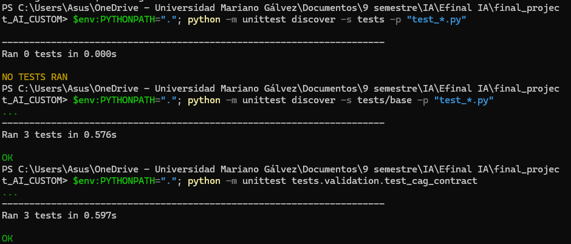
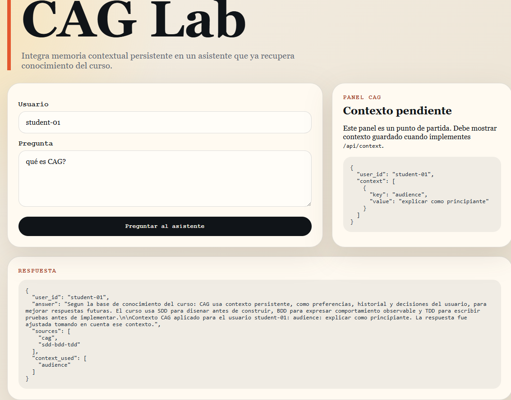
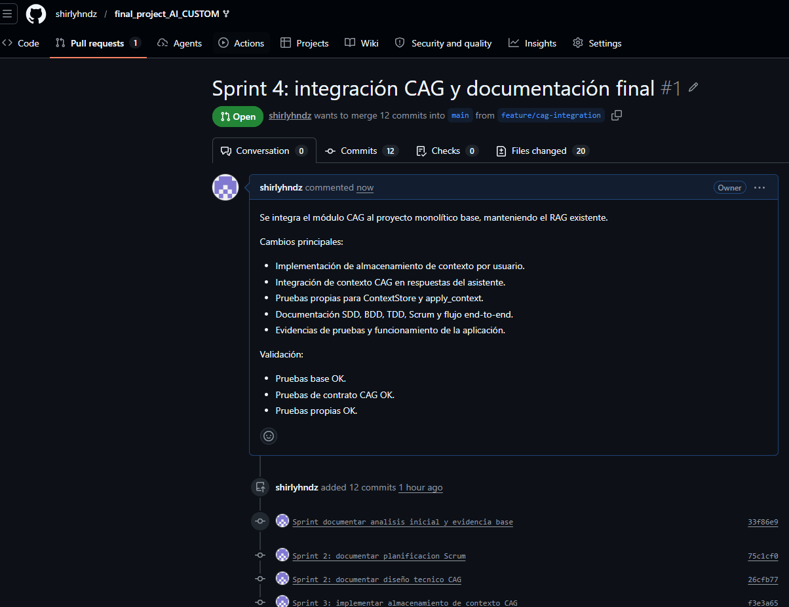
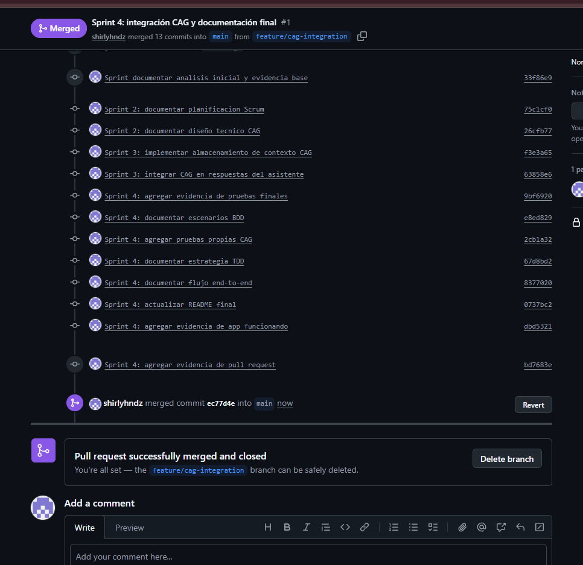

# Proyecto Examen Final - Módulo 3 IA

## Descripción

Este proyecto parte de un monolito base con frontend, backend y recuperación de conocimiento tipo RAG. La mejora implementada consiste en integrar un módulo CAG (Context-Augmented Generation) para guardar, recuperar y utilizar contexto persistente por usuario.

La solución mantiene el RAG existente y agrega una capa de contexto para mejorar respuestas posteriores sin romper la arquitectura base.

## Arquitectura general

El proyecto conserva una arquitectura monolítica organizada por carpetas:

| Carpeta             | Descripción                                   |
| ------------------- | --------------------------------------------- |
| `frontend/`         | Interfaz web para ingresar usuario y pregunta |
| `backend/`          | Servidor, lógica del asistente, RAG y CAG     |
| `data/`             | Base documental usada por RAG                 |
| `tests/base/`       | Pruebas base del proyecto                     |
| `tests/validation/` | Pruebas de contrato CAG                       |
| `tests/student/`    | Pruebas propias agregadas                     |
| `docs/`             | Documentación técnica, Scrum y evidencias     |

## Módulos principales

### RAG

El módulo RAG se encuentra en `backend/knowledge.py`. Recupera fragmentos relevantes desde `data/knowledge_base.json` según la pregunta del usuario.

### CAG

El módulo CAG se implementó en:

* `backend/context_store.py`: guarda y recupera contexto por usuario.
* `backend/cag.py`: aplica el contexto guardado sobre la respuesta.
* `backend/assistant.py`: integra RAG + CAG.
* `backend/server.py`: expone endpoints para contexto y preguntas.

## Endpoints

| Endpoint                   | Método | Descripción                           |
| -------------------------- | ------ | ------------------------------------- |
| `/api/context`             | POST   | Guarda contexto por usuario           |
| `/api/context?user_id=...` | GET    | Recupera contexto guardado            |
| `/api/ask`                 | POST   | Genera una respuesta usando RAG + CAG |

## Ejecución del backend

```powershell
$env:PYTHONPATH="."; python -m backend.server
```

El backend queda disponible en:

```text
http://127.0.0.1:8000
```

## Ejecución del frontend

Abrir el archivo:

```text
frontend/index.html
```

Desde el navegador se puede ingresar un usuario, escribir una pregunta y visualizar la respuesta generada por el backend.

## Pruebas ejecutadas

### Pruebas base

```powershell
$env:PYTHONPATH="."; python -m unittest discover -s tests/base -p "test_*.py"
```

Resultado:

```text
Ran 3 tests
OK
```

### Pruebas de validación CAG

```powershell
$env:PYTHONPATH="."; python -m unittest tests.validation.test_cag_contract
```

Resultado:

```text
Ran 3 tests
OK
```

### Pruebas propias

```powershell
$env:PYTHONPATH="."; python -m unittest discover -s tests/student -p "test_*.py"
```

Resultado:

```text
Ran 3 tests
OK
```

## Documentación incluida

| Documento            | Descripción                          |
| -------------------- | ------------------------------------ |
| `PROMPTS.md`         | Registro cronológico del uso de IA   |
| `docs/SCRUM.md`      | Backlog y planificación en 4 sprints |
| `docs/SDD.md`        | Diseño técnico de la solución        |
| `docs/BDD.md`        | Escenarios de comportamiento         |
| `docs/TDD.md`        | Estrategia de pruebas y validación   |
| `docs/END_TO_END.md` | Flujo completo de frontend a backend |


## Evidencias del proceso

Las evidencias se encuentran en la carpeta:

```text
docs/evidencias/
```

| No. | Evidencia                                                                        | Descripción                                                                      |
| --- | -------------------------------------------------------------------------------- | -------------------------------------------------------------------------------- |
| 01  | [Pruebas base OK](docs/evidencias/01_pruebas_base_ok.png)                        | Validación inicial antes de modificar el proyecto                                |
| 02  | [Validación parcial CAG](docs/evidencias/02_validacion_parcial_cag.png)          | Prueba CAG fallando parcialmente, usada para detectar el problema de integración |
| 03  | [Validación CAG OK](docs/evidencias/03_validacion_cag_ok.png)                    | Pruebas de contrato CAG pasando correctamente                                    |
| 04  | [Pruebas finales OK](docs/evidencias/04_pruebas_finales_ok.png)                  | Validación final de pruebas base y CAG                                           |
| 05  | [Pruebas propias OK](docs/evidencias/05_pruebas_propias_ok.png)                  | Pruebas unitarias propias agregadas en `tests/student/`                          |
| 06  | [App con RAG sin contexto](docs/evidencias/06_app_rag_sin_contexto.png)          | Aplicación funcionando con respuesta basada en RAG                               |
| 07  | [App con CAG usando contexto](docs/evidencias/07_app_respuesta_con_contexto.png) | Aplicación usando contexto persistente en la respuesta                           |
| 08  | [Pull Request creado](docs/evidencias/08_pull_request_creado.png)                | Evidencia del Pull Request dentro del fork                                       |
| 09  | [Merge a main](docs/evidencias/09_merge_a_main.png)                              | Evidencia del merge hacia `main` dentro del fork                                 |

### Capturas principales

#### Validación final de pruebas



#### Aplicación usando CAG con contexto



#### Pull Request y merge






## Uso de IA

La IA se utilizó como asistente de análisis, diseño, documentación y apoyo en pruebas. Las decisiones fueron verificadas manualmente mediante ejecución de pruebas y revisión del código.

El registro completo se encuentra en:

```text
PROMPTS.md
```

## Sprints realizados

| Sprint   | Enfoque                                            |
| -------- | -------------------------------------------------- |
| Sprint 1 | Análisis inicial y pruebas base                    |
| Sprint 2 | Planificación Scrum y diseño técnico               |
| Sprint 3 | Implementación de almacenamiento e integración CAG |
| Sprint 4 | Pruebas, documentación final y evidencias          |

## Alcance logrado

Se logró implementar una capa CAG funcional que:

* Guarda contexto por usuario.
* Recupera contexto persistente en memoria.
* Usa contexto en respuestas posteriores.
* Mantiene el RAG existente.
* Pasa pruebas base, pruebas de contrato y pruebas propias.
